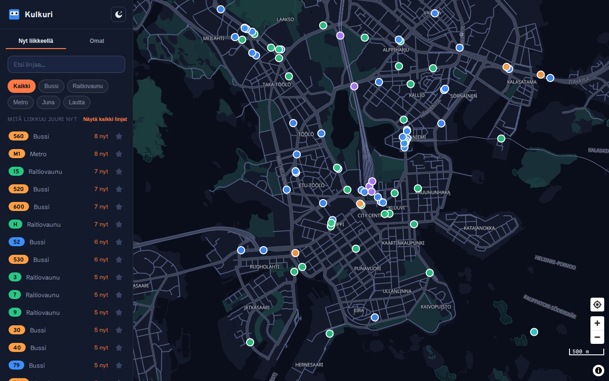
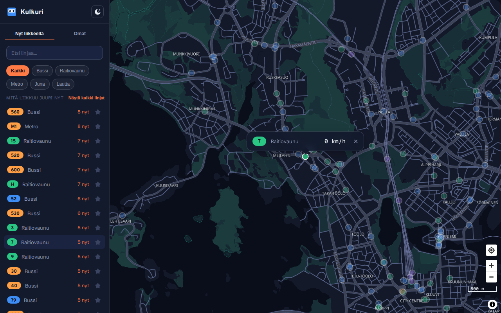
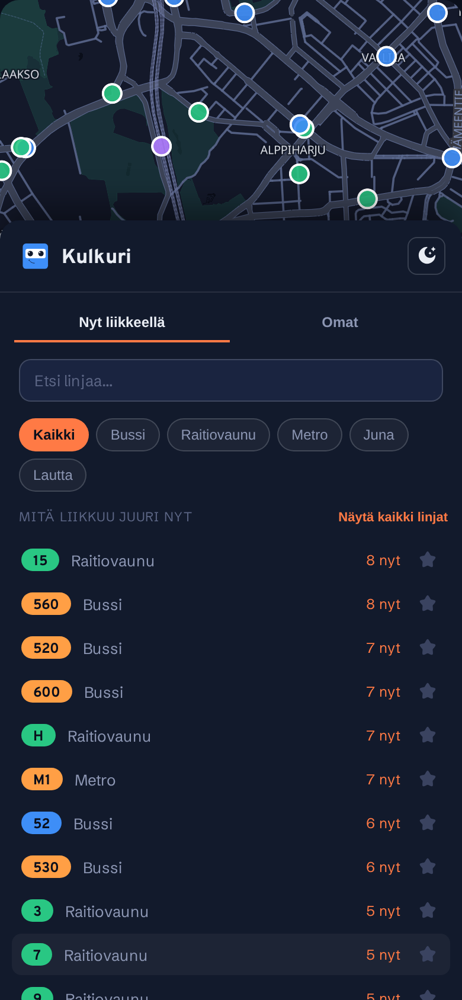
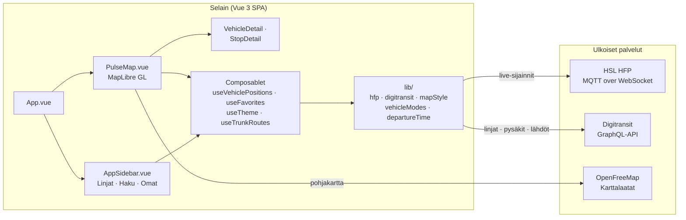

# Kulkuri

[](https://github.com/mkekola/kulkuri/actions/workflows/ci.yml)

**Kulkuri: koko HSL, elossa juuri nyt.**

Kulkuri on live-kartta Helsingin seudun joukkoliikenteestä. HSL:n bussit, raitiovaunut, metrot, junat ja lautat liikkuvat kartalla sulavasti animoituna, ei staattisena aikataulunäkymänä. Ajoneuvoa klikkaamalla näkee sen linjan, määränpään ja nopeuden, ja pysäkkiä klikkaamalla seuraavat lähdöt. Ajoneuvot herätetään kartalle yksi kerrallaan latauksen yhteydessä ("Herääminen") sen sijaan että ne kaikki ilmestyisivät kerralla, ja sama efekti toistuu myös teemaa vaihdettaessa.

**[Kokeile sovellusta täällä →](https://kulkuri.kekola.fi)**

## Kuvakaappaukset

| Päänäkymä                                                 | Ajoneuvon tiedot                                             | Mobiili                                                     |
| --------------------------------------------------------- | ------------------------------------------------------------ | ----------------------------------------------------------- |
|  |  |  |

## Ominaisuudet

- Live-ajoneuvosijainnit HSL:n HFP-syötteestä, päivitysten välillä interpoloituna niin että ne liukuvat sijaintien välillä hyppimisen sijaan
- Ajoneuvoa tai pysäkkiä klikkaamalla avautuu karttaan ankkuroitu tietokortti, joka seuraa sitä liikkeen tai kartan panoroinnin/zoomauksen mukana
- Linjahaku ja -selaus, myös linjoille joilla ei ole ajoneuvoa juuri nyt liikkeellä
- Suosikkilinjat ja -pysäkit "Omat"-välilehdellä; lähipysäkkien merkit kartalla tulevine lähtöineen
- Tumma ja vaalea teema, kummallakin oma uudelleenväritetty pohjakartta
- Mobiililayout: sivupalkki muuttuu vedettäväksi alapalkiksi
- Pariutetut juna-/metroyksiköt (kaksi fyysistä ajoneuvoa samalla vuorolla) yhdistyvät yhdeksi merkiksi kahden päällekkäisen pisteen sijaan
- Valittu ajoneuvo pysyy täysin näkyvissä kartalla, kun taas muut himmenevät kontekstiksi eivätkä katoa
- Laivareittien katkoviivat kartalla, kun zoomaa tarpeeksi lähelle

## Teknologiat

- Vue 3 + TypeScript + Vite
- [MapLibre GL JS](https://maplibre.org/) karttaan (avoin lähdekoodi, ei API-avainta)
- [OpenFreeMap](https://openfreemap.org/) karttalaatoille (ilmainen, ei API-avainta)
- [HSL High-Frequency Positioning (HFP)](https://digitransit.fi/en/developers/apis/5-realtime-api/vehicle-positions/high-frequency-positioning/) MQTT:n yli live-ajoneuvosijainneille (ilmainen, ei API-avainta)
- [Digitransit](https://digitransit.fi/en/developers/) HSL-reititys-API linja-/pysäkkitiedoille ja reittigeometrialle (vaatii ilmaisen tilausavaimen, ks. `.env.example`)
- Vitest testeille
- ESLint
- [Overpass](https://fonts.google.com/specimen/Overpass), [Schibsted Grotesk](https://fonts.google.com/specimen/Schibsted+Grotesk) ja [Martian Mono](https://fonts.google.com/specimen/Martian+Mono) Fontsourcen kautta

## Arkkitehtuuri



Koodi on jaoteltu vastuualueittain, jotta komponentit pysyvät käyttöliittymässä kiinni ja logiikka on testattavissa erillään siitä:

- `src/components/`: `PulseMap.vue` (kartta ja kaikki MapLibre-logiikka: ajoneuvojen interpolointi, "Herääminen"-animaatio, himmennys, vetokahvan fysiikka), `AppSidebar.vue` (linjalista, haku, suosikit, mobiilin vedettävä alapalkki), `VehicleDetail`/`StopDetail` (karttaan ankkuroidut tietokortit)
- `src/composables/`: jaettu reaktiivinen tila, esimerkiksi `useVehiclePositions` (HFP-syöte), `useFavorites` (localStorage), `useTheme`, `useTrunkRoutes`, `useNow`
- `src/lib/`: puhdas logiikka erillään käyttöliittymästä, esimerkiksi `hfp.ts` (MQTT-yhteys, ajoneuvojen pariutus ja vanheneminen), `digitransit.ts` (GraphQL-kutsut), `mapStyle.ts` (pohjakartan paikkaukset), `vehicleModes.ts`, `departureTime.ts`, `anchoredPopup.ts`
- Testit (`*.test.ts`) sijaitsevat samassa kansiossa testattavan tiedoston kanssa

## Käyttöönotto

Asenna riippuvuudet:

```bash
npm install
```

Kopioi `.env.example` tiedostoksi `.env` ja lisää oma Digitransit-tilausavaimesi (tarvitaan vain linja-/pysäkkitietoihin ja reittigeometriaan, ei itse live-karttaan):

```bash
cp .env.example .env
```

Käynnistä kehityspalvelin:

```bash
npm run dev
```

Sovellus on nyt käytettävissä osoitteessa `http://localhost:5173`.

### Testaus ja koodin laatu

```bash
npm run lint    # ESLint
npm run test    # Vitest
```

### Tuotantoversion kääntäminen

```bash
npm run build
```

## Kiitokset

Pysäkki-ikonit (bussi, raitiovaunu, metro, juna, lautta) on rakennettu [Font Awesome Free](https://fontawesome.com/) -kuvakkeista, lisensoitu [CC BY 4.0](https://fontawesome.com/license/free) -lisenssillä.
